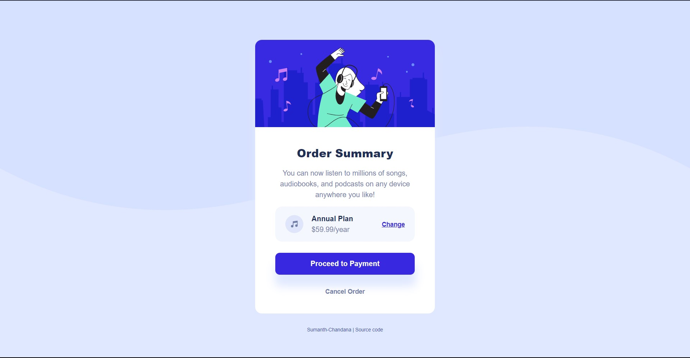

# Frontend Mentor - Order summary card solution

This is a solution to the [Order summary card challenge on Frontend Mentor](https://www.frontendmentor.io/challenges/order-summary-component-QlPmajDUj). Frontend Mentor challenges help you improve your coding skills by building realistic projects. 

## Overview

### The challenge

Users should be able to:

- See hover states for interactive elements

### Screenshot

### Links

- Solution URL: [click here](https://github.com/sumanth-chandana/order-summary-component.git)
- Live Site URL: [Add live site URL here](https://your-live-site-url.com)

### Built with

- 

  

### Tools Used:

- 
 
-	

## Outcome

- Used HTML5 semantic elements for better accessability and readability
- Used Git and GitHub for project management
- Tried to maintain clean code
- Used media queries for responsive design
- Cross tested on Firefox and Chromium based browsers

## Lessons Learned

- Usage transition property for generating smooth hover transitions for both image and buttons
- Usage of Semantic elements to improve accessability for screen readers
- Usage of FLEX layouts in css
- A lot of minor things

## Author

- Frontend Mentor - [@sumanth-chandana](https://www.frontendmentor.io/profile/sumanth-chandana)

